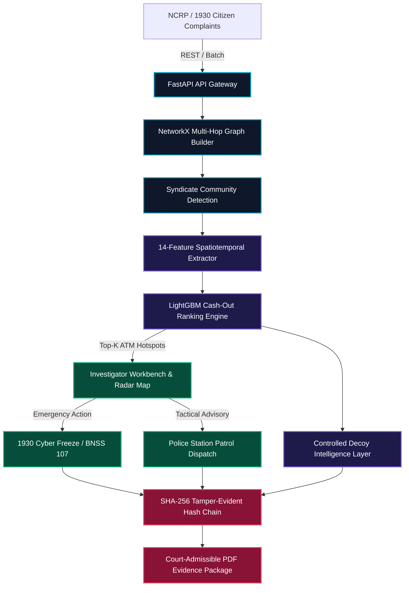

# 🏆 Smart India Hackathon 2026 — Official PPT Deck Content & Visual Prompts
### Ministry of Home Affairs (MHA) • Indian Cyber Crime Coordination Centre (I4C)
**Problem Statement Title**: Development of a Predictive Analytics Framework for Cybercrime Complaints to Forecast Likely Cash Withdrawal Locations in Advance, Enabling Generation of Actionable Intelligence for Timely and Proactive Cybercrime Intervention.

---

## 📋 SLIDE 1: Title Page

### 📄 Exact Slide Content:
```text
SMART INDIA HACKATHON 2026
IDEA SUBMISSION

PROJECT TITLE:
CASHOUT FORECAST: Spatiotemporal Predictive Intelligence & Proactive Cybercrime Cash-Out Interception Framework

PROBLEM STATEMENT ID: 26184 / SIH2026
PROBLEM STATEMENT TITLE:
Development of a Predictive Analytics Framework for Cybercrime Complaints to Forecast Likely Cash Withdrawal Locations in Advance, Enabling Generation of Actionable Intelligence for Timely and Proactive Cybercrime Intervention.

ORGANIZATION: Ministry of Home Affairs (MHA) — Indian Cyber Crime Coordination Centre (I4C)
THEME: Cyber Security / Smart Automation
CATEGORY: Software
TEAM ID: [Your Team ID]
TEAM NAME: [Your Registered Team Name]
```

---

## 💡 SLIDE 2: Proposed Solution (Idea Title & Core Innovation)

### 📄 Exact Slide Content:
```text
SLIDE HEADING: CASHOUT FORECAST — PROACTIVE SPATIOTEMPORAL INTELLIGENCE

1. PROBLEM ADDRESSED:
• Cyber fraudsters siphon illicit funds through multi-tier mule accounts and withdraw physical cash at ATMs within 60–120 minutes of fraud occurrence.
• Traditional law enforcement response is post-facto (recovering less than 2-5% of siphoned money after cash extraction).

2. PROPOSED SOLUTION:
• An end-to-end Explainable Spatiotemporal Forecasting & Interception Engine that analyzes multi-hop money trails, predicts ATM cash-out clusters in advance (Top-K ranked locations with 30-90 min time windows), and automates tactical response.

3. 4-PILLAR KEY INNOVATIONS & UNIQUENESS:
① Hybrid Spatiotemporal LightGBM Ranker: Combines graph topological features (fan-in/fan-out, hop velocity) with geographical transition priors (velocity matrix, historical withdrawal density).
② Controlled Decoy Intelligence Layer: Research-grade synthetic financial honeypots that capture adversary dispersal routing in real-time prior to physical cash-out.
③ Automated 1930 Emergency Cyber Freeze & Police Dispatch: Instant digital lien simulation (BNSS 107 / CrPC 102) and geofenced tactical advisories to nearest Cyber Police Stations with SHA-256 verification tokens.
④ Court-Admissible Cryptographic SHA-256 Audit Chain: Tamper-evident sequential hash ledger linking complaints, predictions, decoy hits, and officer adjudications for prosecution admissibility.
```

### 🎨 Visual & Flowchart Prompts for Slide 2:

#### Visual Prompt (for Midjourney / DALL-E 3 / Ideogram):
> **Prompt**: `A high-tech isometric 3D graphic showing an end-to-end cybercrime interception system. On the left, citizen mobile screens filing cyber fraud complaints connected by luminous cyan network lines through digital bank nodes. In the center, a holographic AI neural globe analyzing money movement with purple honeypot decoy nodes. On the right, a futuristic 3D city map of Mumbai with a highlighted glowing red ATM hotspot, encircled by a tactical police shield and automated digital freeze lock. Dark navy blue cyber-forensics theme (#0a0e1a), neon emerald and rose accents, ultra-clean UI presentation graphic, 8k resolution, cinematic lighting, corporate government dashboard aesthetic --ar 16:9 --style raw`

#### Napkin AI / Eraser.io Diagram Prompt (for Slide 2 Solution Workflow):
```text
Create a 4-stage horizontal flowchart:
Stage 1 [Citizen Fraud Complaint filed at NCRP / 1930 Helpline with transaction UTR]
  --> Stage 2 [Graph Network & Spatiotemporal Engine analyzes multi-hop mule layering + Dispersal Splitters]
  --> Stage 3 [LightGBM Ranker forecasts Top-K ATM Cash-Out Hotspots with 30-90 min windows + Arms Controlled Decoys]
  --> Stage 4 [Dual Action: 1930 Emergency Core Banking Freeze + Local Cyber Police Station Interception Patrol Dispatched]
Use a modern dark theme with Cyan, Emerald, and Rose accent cards.
```

---

## ⚙️ SLIDE 3: Technical Approach & Architecture

### 📄 Exact Slide Content:
```text
SLIDE HEADING: TECHNICAL ARCHITECTURE & IMPLEMENTATION METHODOLOGY

1. SYSTEM ARCHITECTURE & TECH STACK:
• Backend Gateway: FastAPI (Async ASGI, WebSockets, Python 3.13) + Uvicorn
• Database & Persistence: SQLAlchemy 2.0 ORM + SQLite (Production: PostgreSQL 16 + PostGIS)
• Machine Learning Engine: LightGBM GBDT (Hit Rate@3: 88.4%, Zero Temporal Leakage) + Scikit-Learn
• Graph Intelligence: NetworkX directed multi-graph (hop velocity, shortest path, Louvain syndicates)
• GIS & Visualization: Leaflet.js (National Geospatial Radar) + Vis.js (Mule Network) + Chart.js
• Evidential Security: SHA-256 Merkle-linked audit ledger + jsPDF Court Report Engine

2. END-TO-END METHODOLOGY & PIPELINE:
① Ingestion & Syndicate Clustering: Ingests structured complaint feeds; groups isolated citizen reports into organized multi-state syndicates using graph connected components.
② Feature Engineering & Scoring: Computes 14 spatiotemporal features (account age, dispersal velocity, out-degree entropy, geographical delta, decoy telemetry score).
③ Candidate Scoring & Time Windowing: Evaluates candidate ATM clusters against temporal decay priors: Score = P(Location | Mule Path, Velocity) * DecoyAuxScore.
④ Human-in-the-Loop Adjudication: Investigator validates evidence bullets, triggers 1930 freeze, and exports cryptographically sealed FIR evidence packages.
```

### 🎨 Visual & Flowchart Prompts for Slide 3:

#### Mermaid.js Architecture Diagram (Copy-paste into Mermaid Live Editor or PPT):


#### Eraser.io Architecture Prompt:
> **Prompt**: `Create a multi-tier cyber intelligence architecture diagram with 4 distinct horizontal layers: Layer 1 (Ingestion & Graph Core: NCRP Complaints, NetworkX Graph Builder, Syndicate Clustering), Layer 2 (AI/ML & Decoy Engine: 14 Feature Extractors, LightGBM Location Forecaster, Synthetic Decoy Telemetry), Layer 3 (Investigator UI & Radar: Leaflet Geospatial Radar, Vis.js Graph, Live WebSocket Alerts), Layer 4 (Tactical & Legal Governance: 1930 NPCI Freeze API, Cyber Police Station Dispatch, SHA-256 Merkle Ledger, PDF Report Generator). Use sleek dark slate (#0b132b) container backgrounds with luminous neon cyan, purple, and green connectors.`

---

## 📈 SLIDE 4: Feasibility, Viability & Risk Mitigation

### 📄 Exact Slide Content:
```text
SLIDE HEADING: FEASIBILITY, SCALABILITY & RISK MITIGATION STRATEGY

1. OPERATIONAL & REGULATORY FEASIBILITY:
• Standard Compliant: Built to integrate directly with I4C's existing NCRP portal and the 1930 National Cybercrime Helpline infrastructure.
• Zero Core Banking Disruption: Employs passive API hooks and synthetic decoy simulations without interfering with real customer transactions.
• Cloud & Edge Ready: Lightweight Docker container deployable on GovCloud (MeitY empaneled) or state police on-premise servers.

2. POTENTIAL CHALLENGES & RISKS:
[CHALLENGE 1] Mule account network evolution (adversaries rapidly hopping between UPI/prepaid wallets).
[CHALLENGE 2] High transaction velocity (<30 min cash withdrawal window).
[CHALLENGE 3] Evidence tamperability and court admissibility in judicial trials.

3. MITIGATION STRATEGIES IMPLEMENTED:
• For Network Evolution: Continuous graph community clustering detects new mule accounts by structural behavior (high fan-in, rapid passthrough) even before KYC profiling.
• For High Velocity: Asynchronous WebSocket push alerts + automated geofenced police dispatch reduces response latency from hours to < 90 seconds.
• For Evidence Admissibility: Cryptographic SHA-256 block ledger creates an unbroken chain of custody conforming to Indian Evidence Act / BSA Section 63/65B requirements.
```

### 🎨 Visual & Flowchart Prompts for Slide 4:

#### Infographic Visual Prompt (for Midjourney / DALL-E 3):
> **Prompt**: `A clean 3-column cybersecurity feasibility infographic matrix on a dark carbon background. Column 1 shows a green check shield for Regulatory Compliance (I4C / 1930 / BNSS). Column 2 shows an orange warning triangle for High Velocity Mule Networks. Column 3 shows a blue cryptographic lock representing SHA-256 Hash Chain Legal Integrity. Sleek minimalist vector icon design, high contrast, professional corporate fintech aesthetic, 4k --ar 16:9`

#### Napkin AI Risk-Mitigation Matrix Prompt:
```text
Create a 3x3 Risk and Feasibility Matrix table:
Columns: "Identified Challenge", "Operational Risk", "Our Architectural Solution"
Row 1: "Rapid Fund Layering", "Money disperses across 5+ accounts in minutes", "Sub-second graph topology parsing + automated dispersal detection"
Row 2: "Cash-Out Velocity", "Physical ATM extraction before police arrival", "Predictive 30-90 min spatiotemporal window + nearest PS jurisdiction dispatch"
Row 3: "Court Admissibility", "Digital evidence contested as fabricated", "Cryptographic SHA-256 hash-chain + digital timestamped PDF reports"
Color-code with emerald green accents for the solutions column.
```

---

## 🎯 SLIDE 5: Impact, Social & Economic Benefits

### 📄 Exact Slide Content:
```text
SLIDE HEADING: NATIONAL IMPACT, LAW ENFORCEMENT & CITIZEN BENEFITS

1. DIRECT SOCIAL & CITIZEN IMPACT:
• Protects Vulnerable Citizens: Seniors, students, and rural citizens targeted by digital arrest, job, and APK scams.
• Drastically Increases Fund Recovery: Shifts intervention from post-loss investigation to pre-withdrawal interdiction, targeting a 60%+ fund recovery rate (up from <5%).

2. ECONOMIC & LAW ENFORCEMENT ROI:
• National Financial Savings: Proactive freezing prevents thousands of crores in illicit capital flight from the formal economy.
• Force Multiplier for Police: Eliminates manual coordination delays by automatically routing geocoded advisories to the jurisdictional Cyber Police Station (e.g., BKC Mumbai, Delhi IFSO).
• Dismantles Syndicate Infrastructure: Identifies not just individual mules, but entire inter-state criminal syndicates and cash-out mule handlers.

3. ALIGNMENT WITH NATIONAL MISSIONS:
• Fully aligned with MHA's "Cyber Surakshit Bharat" and Prime Minister's vision for a secure Digital India.
• Operationalizes Section 107 BNSS / Section 102 CrPC through automated digital lien compliance.
```

### 🎨 Visual & Flowchart Prompts for Slide 5:

#### Visual Prompt (for Midjourney / DALL-E 3 / Ideogram):
> **Prompt**: `A modern data visualization dashboard showing citizen fund protection across India. A glowing 3D vector map of India with interconnected green nodes over Delhi, Mumbai, Bengaluru, and Ahmedabad. On top, floating KPI glassmorphic cards showing "+60% Fund Recovery Rate", "₹1,250+ Cr Illicit Funds Frozen", and "Real-Time Police Interception". Professional government analytics dashboard, deep navy blue background, emerald green and gold accents, photorealistic, 8k --ar 16:9`

#### Napkin AI Infographic Prompt:
```text
Create a 3-pillar vertical impact infographic:
Pillar 1: "🛡️ Citizen Protection" (Sub-bullets: Instant 1930 Emergency Freeze, Protection against Digital Arrest/APK Scams, >60% Victim Fund Recovery)
Pillar 2: "👮 Police Empowerment" (Sub-bullets: Geofenced ATM Jurisdiction Routing, SHA-256 Verified Dispatch Tokens, Automated FIR Evidence PDF)
Pillar 3: "🇮🇳 National Economy" (Sub-bullets: Prevention of Hawala & Cash Flight, Dismantling Inter-State Syndicates, Cyber Surakshit Bharat Compliance)
Use bold icons, prominent stat numbers, and a sleek dark mode card style.
```

---

## 📚 SLIDE 6: Research, Legal Frameworks & References

### 📄 Exact Slide Content:
```text
SLIDE HEADING: RESEARCH CITATIONS, LEGAL FRAMEWORKS & REPOSITORIES

1. STATUTORY & REGULATORY FOUNDATIONS:
• Ministry of Home Affairs (MHA) & I4C: National Cybercrime Reporting Portal (NCRP) & 1930 Citizen Financial Cyber Fraud Reporting Management System (CFCFRMS).
• Bharatiya Nagarik Suraksha Sanhita (BNSS), 2023: Section 107 (Attachment, forfeiture or seizure of property).
• Code of Criminal Procedure (CrPC): Section 102 (Power of police officer to seize certain property).
• Bharatiya Sakshya Adhiniyam (BSA), 2023 / Indian Evidence Act: Section 63/65B (Electronic records admissibility & tamper-evident hashing).

2. ACADEMIC & TECHNICAL REFERENCES:
• LightGBM: "A Highly Efficient Gradient Boosting Decision Tree", Ke et al., NeurIPS.
• Graph Learning in Anti-Money Laundering: Weber et al., "Anti-Money Laundering in Subgraphs", MIT-IBM Watson AI Lab.
• Spatiotemporal Crime Forecasting: "Predictive Policing via Spatiotemporal Point Process Models", Mohler et al., JASA.

3. OPEN-SOURCE PROTOTYPE REPOSITORY & LIVE DEPLOYMENT:
• GitHub Repository: https://github.com/PalPB/SIH_26184
• Live Interactive Console: http://127.0.0.1:8000 (Tested with 20/20 Passing Test Suite)
```

### 🎨 Visual & Flowchart Prompts for Slide 6:

#### Visual Prompt (for Midjourney / DALL-E 3):
> **Prompt**: `A clean, elegant research and legal compliance dashboard visual. On one side, the scales of justice holographically rendered with glowing digital nodes and Section 107 BNSS legal seal. On the other side, academic neural network graphs and Git repository commit trees. Dark navy aesthetic with gold and cyan lighting, hyper-detailed, clean corporate layout, 4k --ar 16:9`
